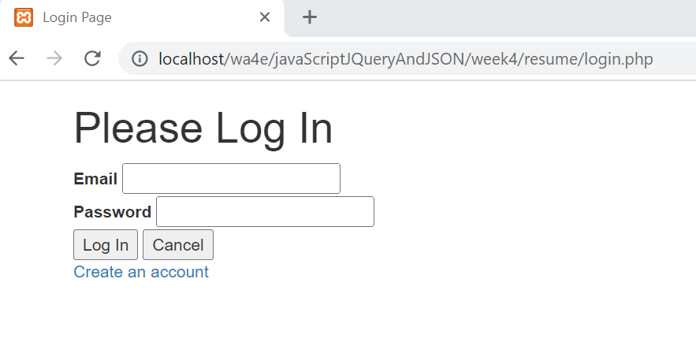
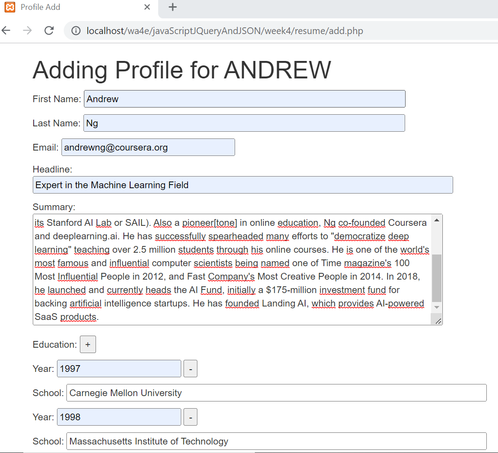

# Basic Resume CRUD Application in PHP

Simple application that has multiple screens to Create, Read, Update and Delete (CRUD) data.

Click [here](https://resume-crud-app.herokuapp.com/index.php") to play with this app.
___

### Concepts Used

* Request/Response Cycle, including GET/POST/Redirect
* Database Design
* PDO (Portable Data Objects ) library to connect to a MySQL and issue SQL commands in the the PHP language
* Web Security (SQL Injection / HTML Injection)
* PHP Cookies and Session data
* jQuery library to do in-browser manipulation of the DOM (Document Object Model) and event handling
* JSON (JavaScript Object Notation) used to exchange data between code running on the server (i.e. in PHP) and code running in the browser (JavaScript/jQuery)
___

### Get started

Setup Configuration :

Create an account an just log in to test and play with this app
___

### Preview

<table>
	<tr>
		<td></td>
		<td></td>
	</tr>
	<tr>
		<td></td>
		<td></td>
	</tr>
	<tr>
		<td></td>
		<td></td>
	</tr>
	<tr>
		<td></td>
		<td></td>
	</tr>
	<tr>
		<td></td>
		<td></td>
	</tr>
</table>

